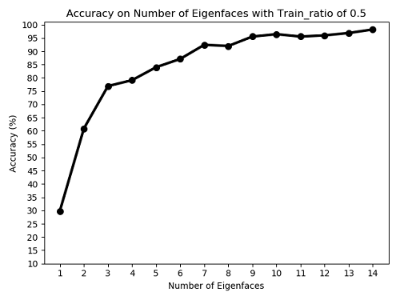

# Face Recognition Based on Local-Feature-Descriptors and FisherFaces

This project is an implementation for human face recognition based on local feature descriptors and fisher_faces, coded in Python language.

For local feature descriptors, here we use SIFT, SURF, ORB to extract the local feature descriptor of human face.

## Project Structure

+ Runnable Python source file are [FaceRecognition_Eigenface.py](./FaceRecognition_Eigenface.py) and [FaceRecognition_LocalDescriptor.py](./FaceRecognition_LocalDescriptor.py), which are implemented on Eigen Faces and Local Feature Descriptor.
JUST CLONE THE REPOSITORY AND RUN IT!
+ Human face image dataset is in [YALE_IMAGES](./YALE_IMAGES) directory, which contains 15 face classes, and each class contains 11 face images.
+ For face recognition based on local feature descriptors, [Dataset](./dataset/local_descriptor) and [dictionary](./dictionary/local_descriptor) directories are outputs of the runnable Python script, [dataset](./dataset) is the histogram set of training images while [dictionary](./dictionary) is learned from the dataset using Kmeans algorithm.
+ P.S. Clear the two directory ([dataset](./dataset/local_descriptor) and [dictionary](./dictionary/local_descriptor)) to rebuild visual dictionary and retrain the classifier.

## Results
+ Result of Local Feature Descriptors
  ------

+ Eigen Faces
  ------

+ Result of Eigen Faces 
  ------

## Dependency

* [OpenCV 3.4.1](https://opencv.org/opencv-3-4-1/)

## References
* [1] Low, D.G.. (2004). Distinctive image features from scale-invariant keypoints. 60. 91-110. 
* [2] Karami, E. , Prasad, S. , & Shehata, M. . (2015). Image Matching Using SIFT, SURF, BRIEF and ORB: Performance Comparison for Distorted Images. 2015 Newfoundland Electrical and Computer Engineering Conference. 
* [3] Turk, Matthew Alan , and A. P. Pentland . "Eigenfaces for recognition." Journal of Cognitive Neuroence (1991). 
* [4] Belhumeur P.N., Hespanha J.P., Kriegman D.J. (1996) Eigenfaces vs. Fisherfaces: Recognition using class specific linear projection. In: Buxton B., Cipolla R. (eds) Computer Vision ¡ª ECCV '96. ECCV 1996. Lecture Notes in Computer Science, vol 1064. Springer, Berlin, Heidelberg. https://doi.org/10.1007/BFb0015522

## Author Info
LeoHao (XMU-CS)

## Date
2020.11.26

